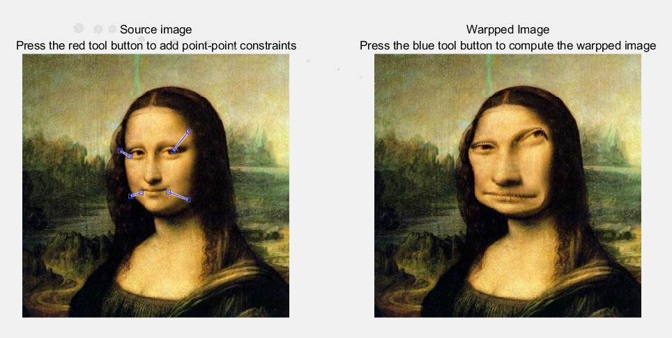

## **【报告】Radial Basis Functions**

### **1.【概括】**

Matlab 使用 RBF 算法实现图像变形。

### **2.【算法介绍】**

#### **(1).【概述】**

设起始点、目标点坐标向量分别为 $\boldsymbol{p_i},\boldsymbol{q_i}(1\leqslant i\leqslant n)$，构造变换函数 $f(\boldsymbol x)=\sum_{k=1}^{n}\boldsymbol{a_k}b_{k}(\boldsymbol x)$，其中 $b_k(\boldsymbol x)=\frac{1}{||\boldsymbol x-\boldsymbol {p_k}||^2+d},d$ 为常数，$\boldsymbol {a_k}(1\leqslant k\leqslant n)$ 为所需寻找的权重。该权重满足方程 $f(\boldsymbol {p_i})=\boldsymbol{q_i}-\boldsymbol {p_i}$，即 $\sum_{k=1}^{n}\boldsymbol{a_k}b_{k}(\boldsymbol {p_i})=\boldsymbol {q_i}-\boldsymbol {p_i}$ 。

解出权重值，对坐标进行变换 $\boldsymbol {x}\rightarrow \boldsymbol {x}+f(\boldsymbol {x})$ 得到新图像。

#### **(2).【初始化小细节】**

通过绘图测试可知起始点、终止点的坐标 $(x,y)$ 分别对应横纵轴，而图像矩阵的储存与之相反。故对前者进行交换。

```python
#交换横纵坐标
n = size(psrc,1);
P=zeros(n,2);P(:,1)=psrc(:,2);P(:,2)=psrc(:,1);
Q=zeros(n,2);Q(:,1)=pdst(:,2);Q(:,2)=pdst(:,1);
```

#### **(3).【参数计算】**

```python
#传入两个坐标计算距离
function ans_dis = calc_dis(p1,p2)
ans_dis = (p1(1)-p2(1))*(p1(1)-p2(1))+(p1(2)-p2(2))*(p1(2)-p2(2));
end
```

```python
#传入两个坐标计算b值
function ans_b = calc_b(p1,p2)
dis_S2=calc_dis(p1,p2);
d=500;
ans_b = 1.0/(dis_S2+d);
end
```

#### **(4).【解权重】**

设 $\boldsymbol Q=(q_{ij})_{n\times 2},\boldsymbol B=(b_{ij})_{n\times n},\boldsymbol A=(a_{ij})_{n\times 2}$

则得到关于 $\boldsymbol A$ 方程的 $\boldsymbol B\boldsymbol A=\boldsymbol Q$，解得 $\boldsymbol A=\boldsymbol B^{-1}\boldsymbol Q$ 。 

```python
#高斯消元解方程组，构造增广炬阵(B,Q)，消元得到(I,A)
function ans_A = Gause(B,Q,n)
A=zeros(n,n+2);
A(1:n,1:n)=B(1:n,1:n);
A(1:n,n+1:n+2)=Q(1:n,1:2);
for j=1:n
    w=j;
    for i=j+1:n
        if A(w,j)<A(i,j)
            w=j;
        end
    end
    tmp=A(j,:);A(j,:)=A(w,:);A(w,:)=tmp;
    for i=1:n
        if i~=j
            temp=A(i,j)/A(j,j);
            A(i,j:n+2)=A(i,j:n+2)-A(j,j:n+2)*temp;
        end
    end
end
ans_A=A(1:n,n+1:n+2);
for i=1:n
    ans_A(i,1)=ans_A(i,1)/A(i,i);
    ans_A(i,2)=ans_A(i,2)/A(i,i);
end
end
```

ps：消元写好了之后才发现Matlab内置有矩阵求逆运算，直接用`A=eye(n)/B*Q;`就可以了。。。

#### **(5).【坐标变换】**

由原坐标 $\boldsymbol {x}$ 变换得到的 $\boldsymbol {x}'=\boldsymbol {x}+f(\boldsymbol {x})$ 为实数，首先应转化为整数。对实数加 $0.5$ 再向下取整即可实现四舍五入。

此外，还应判断 $\boldsymbol x'$ 是否在 $(0\sim h)\times(0\sim w)$ 以内。

```python
for i=1:h
    for j=1:w
        p_now=[i,j];p_to=[i,j];
        for o=1:2
            for k=1:n
                p_to(o)=p_to(o)+A(k,o)*calc_b(p_now(:),P(k,:));
            end
        end
        tx=floor(p_to(1)+0.5);ty=floor(p_to(2)+0.5);
        if tx>0&&tx<=h&&ty>0&&ty<=w
            im2(tx,ty,:)=im(i,j,:);
        end
    end
end
```

### **3.【结果分析】**

#### **(1).【初步结果】**

常数 $d$ 调整至 $500$，如上算法可得以下效果：


原因在于坐标变换失去了许多像素点（多个实数向下取整对应同一个整数，且可能变换到图像外部被舍去）。

#### **(2).【算法完善：像素补全1】**

用 $01$ 数组记录每个坐标是否被覆盖，对于空洞点，用周围四个方向相邻点进行补全修复。

```python
for i=1:h
    for j=1:w
        if pan(i,j)==0
            #取相邻点进行修复
            if i<h&&pan(i+1,j)==1
                im2(i,j,:)=im2(i+1,j,:);pan(i,j)=1;
            elseif j<w&&pan(i,j+1)==1
                im2(i,j,:)=im2(i,j+1,:);pan(i,j)=1;
            elseif i>1&&pan(i-1,j)==1
                im2(i,j,:)=im2(i-1,j,:);pan(i,j)=1;
            elseif j>1&&pan(i,j-1)==1
                im2(i,j,:)=im2(i,j-1,:);pan(i,j)=1;
            else 
            end
        end
    end
end
```

修复得到以下结果：



似乎还有明显噪点，需要更精细的填补方法

#### **(3).【算法完善：像素补全2】**

对于空洞点，先查找四个方向有几个位置已被填补，数目记为 $cnt$ 。然后对这 $cnt$ 个像素大小求和取平均值，得到该点所填颜色。

```python
cnt=0;
if i<h&&pan(i+1,j)==1 cnt=cnt+1; end
if j<w&&pan(i,j+1)==1 cnt=cnt+1; end
if i>1&&pan(i-1,j)==1 cnt=cnt+1; end
if j>1&&pan(i,j-1)==1 cnt=cnt+1; end
                
color=zeros(1,dim);
for o=1:dim
	if i<h&&pan(i+1,j)==1 color(1,o)=color(1,o)+im2(i+1,j,o)/cnt; end
	if j<w&&pan(i,j+1)==1 color(1,o)=color(1,o)+im2(i,j+1,o)/cnt; end
	if i>1&&pan(i-1,j)==1 color(1,o)=color(1,o)+im2(i-1,j,o)/cnt; end
	if j>1&&pan(i,j-1)==1 color(1,o)=color(1,o)+im2(i,j-1,o)/cnt; end
end

im2(i,j,:)=color(:);pan(i,j)=1;
```

效果显著：


