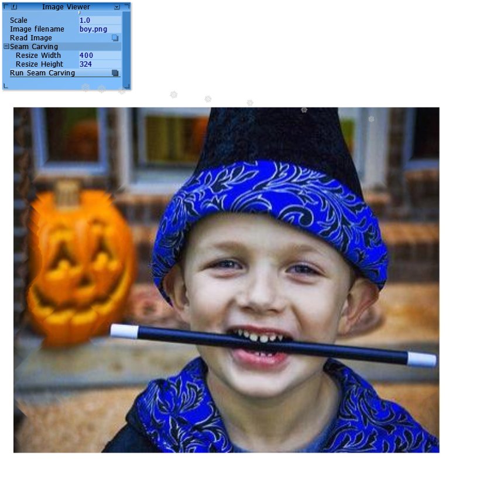
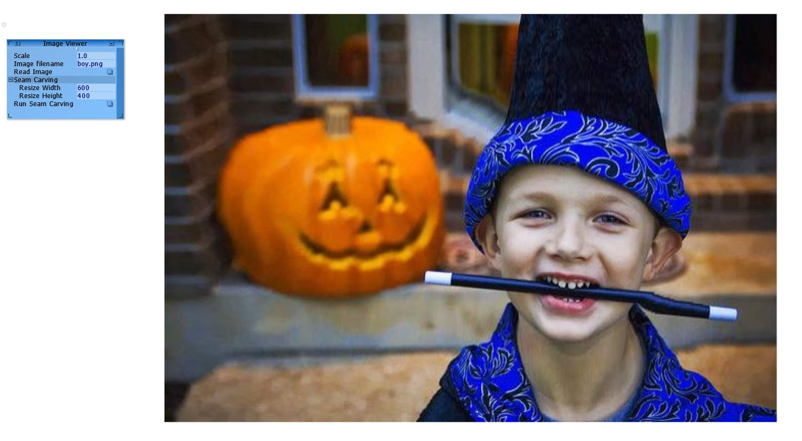

## **【报告】Seam Carving**

### **1.【概括】**

C++ 实现 Seam Carving 图像缩放算法。

给定输入图片及指定目标图像尺寸，运行 Seam Carving 算法，输出内容感知的缩放结果。

### **2.【算法介绍】**

#### **(1).【概述】**

在每个像素点上定义能量函数 $e(x,y)$（使用显著度图）。

水平方向缩小图像时，选取经过点能量之和最小的八连通竖直路径 $seam$，将其删除。竖直方向缩小时，则选取从左到右的路径。

放大图像时，仍旧选取如上最短路，让其与相邻点取平均值然后插入。为防止每次都找到同一条路径，一次性预处理出 $k$ 条不相交的 $seam$ 再一起插入。

#### **(2).【读取信息】**

用 $n\times m$ 的二维数组储存 $h\times w$ 图像信息，方便后续删除/插入操作。

```cpp
Re n=img.height(),m=img.width(),K=img.dim();
MyImage sal("boy_saliency.png"),Ans=img;
//【拷贝信息】//
if(!a.empty())a.clear();if(!e.empty())e.clear();
for(Re i=0;i<n;++i){
    if(!b.empty())b.clear();
    for(Re j=0;j<m;++j){
        if(!c.empty())c.clear();
        for(Re k=0;k<K;++k)c.push_back(img.data()[(i*m+j)*K+k]);
        b.push_back(c);
    }
    a.push_back(b);

    if(!d.empty())d.clear();
    for(Re j=0;j<m;++j)d.push_back(sal.data()[(i*m+j)*K+0]);
    e.push_back(d);
}
```

#### **(3).【水平缩放】**

用 $n$ 条大小为 $m$ 的链表 $F[i]$ 记录每个点是否被删除。

求最短 $seam$ 路径使用动态规划：$dp(i,j)=e(i,j)+\min\{dp(i-1,j-1),dp(i-1,j),dp(i-1,j+1)\}$，状态转移时顺带用数组 $g$ 记录最优决策点，便于查询路径经过点。

每次找到 $seam$ 路径后直接删除，同时用 $Q$ 记录。

```cpp
//【水平缩放】//
if(!dp.empty())dp.clear();if(!g.empty())g.clear();
dp=e,g=e;
//链表初始化
I.creat(m);if(!F.empty())F.clear();
for(Re i=0;i<n;++i)F.push_back(I);
Re add=abs(w-m);add=std::min(add,m);//最多允许扩大到原来的两倍
if(!Q.empty())Q.clear();if(!d.empty())d.clear();
for(Re O=0;O<add;++O)d.push_back(0);
for(Re i=0;i<n;++i)Q.push_back(d);
for(Re O=0;O<add;++O){//找竖直路径
    for(Re i=1;i<n;++i)
        for(Re j=F[i].first(),j_=F[i-1].first(),p;j!=-1;j=F[i].nex(j),j_=F[i-1].nex(j_)){
            Re tmp=dp[i-1][g[i][j]=j_];
            if((p=F[i-1].pre(j_))!=-1&&dp[i-1][p]<tmp)tmp=dp[i-1][g[i][j]=p];
            if((p=F[i-1].nex(j_))!=-1&&dp[i-1][p]<tmp)tmp=dp[i-1][g[i][j]=p];
            dp[i][j]=e[i][j]+tmp;
        }
    Re ans=dp[n-1][F[n-1].first()],pos=F[n-1].first();
    for(Re j=F[n-1].first();j!=-1;j=F[n-1].nex(j))if(dp[n-1][j]<ans)ans=dp[n-1][pos=j];//找到最小路径
    for(Re i=n-1;i>=0;--i)F[i].del(Q[i][O]=pos),pos=g[i][pos];//删除每行的pos，并记录
}
```

若要放大图像则还需进行插入操作，对每一行的 $seam$ 点从小到大排序，按从右到左的顺序处理。

```cpp
if(w>m){//水平放大
    int add=w-m;
    for(Re i=n-1;i>=0;--i){
        std::sort(Q[i].begin(),Q[i].end());
        Re p=m-1,ed=m-1+add;
        for(Re k=0;k<add;++k)a[i].push_back(a[i][0]),e[i].push_back(0);
        for(Re k=add-1;k>=0;--k){
            while(p>Q[i][k])e[i][ed]=e[i][p],a[i][ed--]=a[i][p--];
            //此时p==Q[k]
            if(Q[i][k]>0)e[i][ed]=e[i][p],a[i][ed--]=a[i][p--];//默认向左加边，p=Q[k]-1
            else p++;//在左边界时向右加边，p=Q[k]+1
            for(Re o=0;o<K;++o)a[i][ed][o]=(a[i][Q[i][k]][o]+a[i][p][o])/2;
            e[i][ed--]=(e[i][Q[i][k]]+e[i][p])/2;
        }
    }
}
```

#### **(4).【输出图像】**

若图像被缩小，则遍历链表，将未被删除的取出。

若图像被放大，在前面的操作中已将图像扩展完成。

```python
//【输出图像】//
if(!A.empty())A.clear();if(!E.empty())E.clear();
for (int i=0;i<n;i++)
if(w<m){
    for(int j=F[i].first();j!=-1;j=F[i].nex(j))
        for(int k=0;k<K;++k)A.push_back(a[i][j][k]),E.push_back(e[i][j]);
    
}
else{
    for(int j=0;j<m+add;++j)
        for(int k=0;k<K;++k)A.push_back(a[i][j][k]),E.push_back(e[i][j]);
}
```

#### **(5).【竖直缩放】**

对图像进行 $90°$ 翻转，使用上述水平缩放方法即可。

### **3.【结果分析】**





实际效果差强人意，似乎是算法本身的局限性（也可能受能量函数选取影响）。