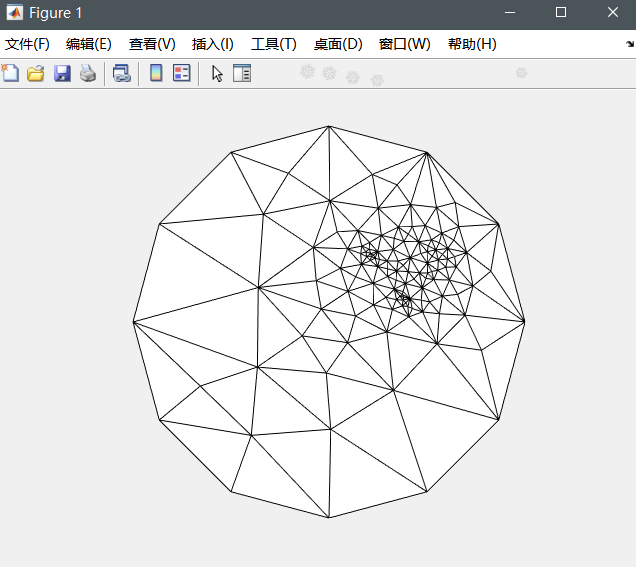

## **【报告】Tutte参数化**

### **1.【概括】**

Matlab 实现基于均匀权重的 $\text{Tutte}$ 参数化。

给定输入开放网格，固定边界至简单平面凸多边形，例如单位圆，通过求解基于均匀权重的 $\text{Laplace}$ 方程获得网格内部顶点的参数化坐标。 

### **2.【算法介绍】**

#### **(1).【概述】**

读入三维三角网格面 $(V,E)$。首先寻找边界点 $B\subset V$，将其固定在二维圆（凸多边形）上。内部点赋予权值进行计算：$P_i=\sum_{e(i,j)\in E}w_{ij}P_j$ 。

均匀权值定义为 $w_{ij}=\frac{1}{d_i}$，其中 $d_i$ 为点 $i$ 的度数（即每个点 $i$ 是其邻点组成的多边形的重心 ）。

#### **(2).【读取信息】**

用邻接矩阵 $e$ 储存连边信息。

```python
[x,f]=readObj('cathead');%x为点，f为每个三角面的三点序号
m=size(x,1);%m:点总个数
e=zeros(m,m);%邻接矩阵
for i=1:size(f,1)
    e(f(i,1),f(i,2))=1;e(f(i,2),f(i,1))=1;
    e(f(i,1),f(i,3))=1;e(f(i,3),f(i,1))=1;
    e(f(i,2),f(i,3))=1;e(f(i,3),f(i,2))=1;
end
```

#### **(3).【计算坐标】**

由式子 $P_i=\begin{cases}\sum_{e(i,j)\in E}w_{ij}P_j & P_i\notin B \\P_i & P_i\in B \end{cases}$ 得到线性方程组 $\boldsymbol{Ax}=\boldsymbol b$，解得 $\boldsymbol x$ 即为参数化二维坐标。

```python
A=zeros(m,m);b=zeros(m,2);
for i=1:m
    cnt=0;
    for j=1:m
        if e(i,j)==1
            cnt=cnt+1;
            A(i,j)=1;
        end
    end
    A(i,:)=A(i,:)/cnt;
    A(i,i)=-1;
end

B=findBoundary(x,f);n=size(B,2);%边界点个数
theta=2.0*pi/n;
for i=1:n%遍历边界点
    b(B(i),:)=[cos(i*theta) sin(i*theta)];%单位圆边界
    A(B(i),:)=0;A(B(i),B(i))=1;
end
```

### **3.【结果分析】**


