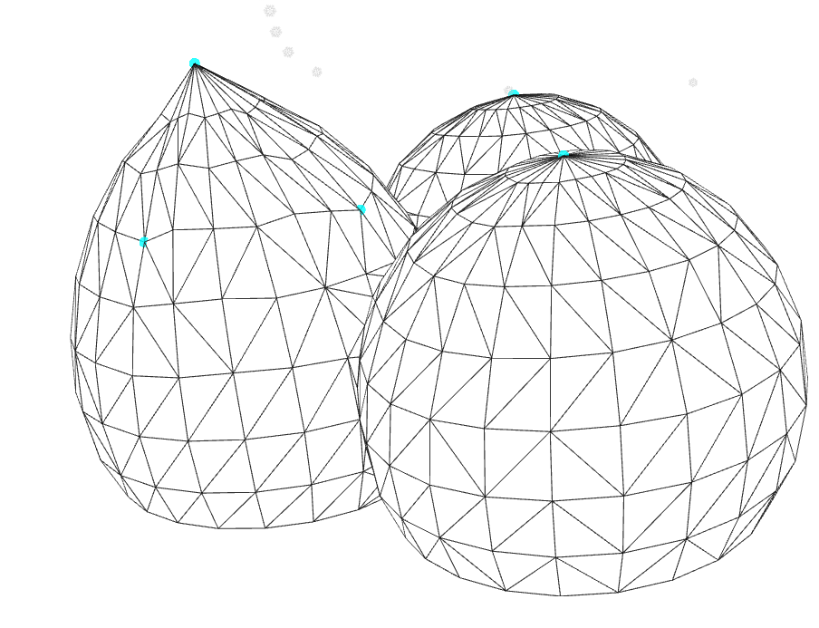
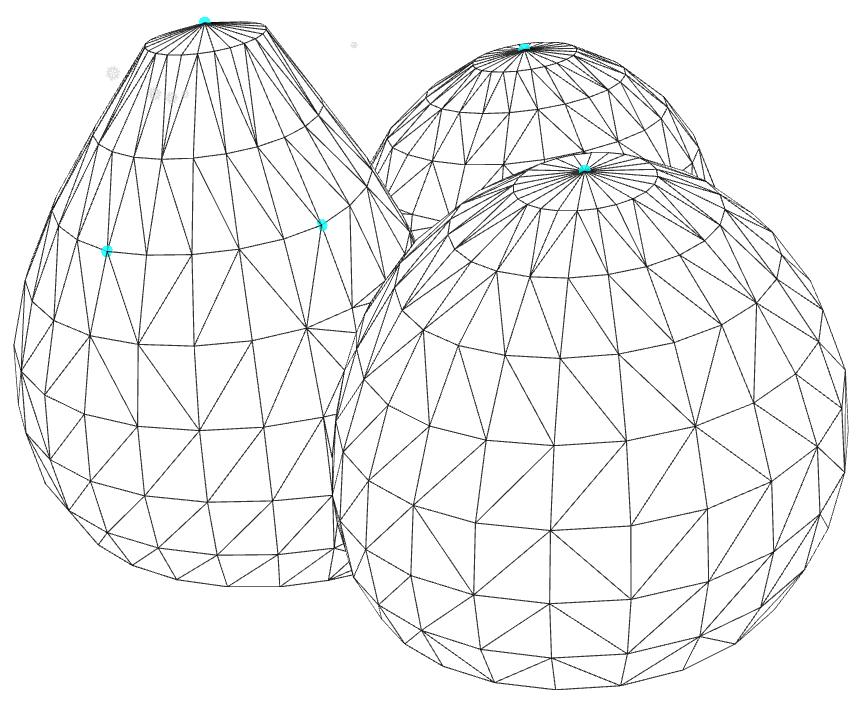
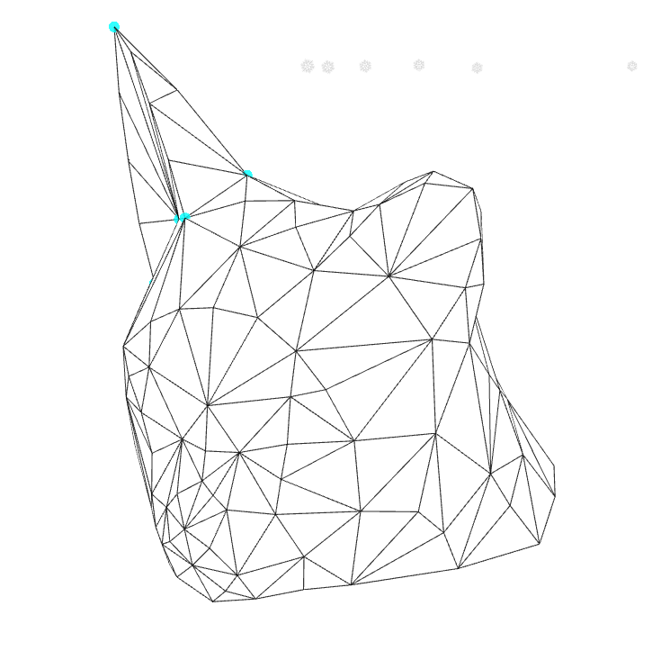

## **【报告】Laplacian Mesh Processing**

### **1.【概括】**

C++ 实现 Laplace 网格变形算法。

### **2.【算法介绍】**

#### **(1).【概述】**

设为三维网格原坐标点集为 $V=\{\boldsymbol v_i|1\leqslant i\leqslant n\}$，边集合为 $E$，现在选取了 $m$ 个约束点 $I_i(1\leqslant i\leqslant m)$ 固定或移动它们的位置（新位置设为 $\boldsymbol u_i$）。

定义拉普拉斯坐标为 $\delta_i=\mathcal L(\boldsymbol v_i)=\boldsymbol v_i-\frac{1}{\sum_{(i,j)\in E}w_{ij}}\sum_{(i,j)\in E}w_{ij}\boldsymbol v_j=\boldsymbol v_i-\sum_{(i,j)\in E}w'_{ij}\boldsymbol v_j$，其中 $w_{ij}$ 为权重。

均匀权重定义为 $w_{ij}=1$，即 $w'_{ij}=\frac{1}{d_i}$，其中 $d_i$ 为点 $i$ 在图上的度数。

$cot$ 权重定义为 $w_{ij}=\cot(\alpha)+\cot(\beta)$，其中 $\alpha,\beta$ 分别为边 $ij$ 在包含此边的三角面上的对角。

拉普拉斯坐标保存相对坐标信息，网格变形不影响相对坐标。根据拉普拉斯坐标计算公式建立变换矩阵 $\boldsymbol L$，作用于 $\boldsymbol V$ 得到 $\boldsymbol \Delta=\boldsymbol L \boldsymbol V$，添加约束点信息后再反解出 $\boldsymbol V'$ 得到网格变形之后的新坐标。

#### **(2).【读取信息】**

记录每条边所属的两个（或一个）三角面中对角顶点编号，方便后续计算 $\cot$ 权重。

```python
//meshX：点坐标，meshF：三角面
int n=meshX.rows(),m=Id.size(),nf=meshF.rows();
std::vector<std::vector<int> >E1,E2;std::vector<int> tmpp,du;
std::vector<std::vector<float> >W;std::vector<float> tmpp_,sw;
for(Re i=0;i<n;++i)tmpp.push_back(-1),tmpp_.push_back(0),du.push_back(0),sw.push_back(0);
for(Re i=0;i<n;++i)E1.push_back(tmpp),E2.push_back(tmpp),W.push_back(tmpp_);
for(Re i=0;i<nf;++i){//根据三角面构建边信息，同时记录每条边所在的两个或一个三角面里的对角顶点。
    int a=meshF(i,0),b=meshF(i,1),c=meshF(i,2);
    if(E1[a][b]==-1)E1[a][b]=E1[b][a]=c,++du[a],++du[b];//首次连边，记录点的度数
    else E2[a][b]=E2[b][a]=c;//第二个对角顶点
    if(E1[a][c]==-1)E1[a][c]=E1[c][a]=b,++du[a],++du[c];
    else E2[a][c]=E2[c][a]=b;
    if(E1[b][c]==-1)E1[b][c]=E1[c][b]=a,++du[b],++du[c];
    else E2[b][c]=E2[c][b]=a;
}
```

#### **(3).【初始化矩阵信息】**

$\boldsymbol V=(\boldsymbol v_1,\boldsymbol v_2,..\boldsymbol v_n)^{T}$，$\boldsymbol L=\begin{cases}1&i=j\\-w'_{ij}& i\neq j\\ 0&otherwise.\end{cases}$

用稀疏矩阵存储加速运算。

```cpp
//计算L矩阵
#define Tri Eigen::Triplet<float>
#define up(_,__,___) ijv.push_back(Tri(_,__,___))
std::vector<Tri > ijv;//三元组构造系数矩阵
for(Re i=0;i<n;++i)
    up(i,i,1.0),
    V.insert(i,0)=meshX(i,0),
    V.insert(i,1)=meshX(i,1),
    V.insert(i,2)=meshX(i,2);
```

```cpp
//均匀权重：
for(Re i=0;i<nf;++i){
    int a=meshF(i,0),b=meshF(i,1),c=meshF(i,2);float w;
    if(E1[a][b]==c)w=1.0/du[a],up(a,b,-w),w=1.0/du[b],up(b,a,-w);
    if(E1[a][c]==b)w=1.0/du[a],up(a,c,-w),w=1.0/du[c],up(c,a,-w);
    if(E1[b][c]==a)w=1.0/du[b],up(b,c,-w),w=1.0/du[c],up(c,b,-w);
}
```

```cpp
//Cot权重
for(Re i=0;i<nf;++i){
    int a=meshF(i,0),b=meshF(i,1),c=meshF(i,2);
    if(E1[a][b]==c){
        W[a][b]=1.0/tan(get_ankle(c,a,b));
        if(E2[a][b]!=-1)W[a][b]+=1.0/tan(get_ankle(E2[a][b],a,b));
        W[b][a]=W[a][b]; sw[a]+=W[a][b],sw[b]+=W[a][b];
    }
    if(E1[a][c]==b){
        W[a][c]=1.0/tan(get_ankle(b,a,c));
        if(E2[a][c]!=-1)W[a][c]+=1.0/tan(get_ankle(E2[a][c],a,c));
        W[c][a]=W[a][c]; sw[a]+=W[a][c],sw[c]+=W[a][c];
    }
    if(E1[b][c]==a){
        W[b][c]=1.0/tan(get_ankle(a,b,c));
        if(E2[b][c]!=-1)W[b][c]+=1.0/tan(get_ankle(E2[b][c],b,c));
        W[c][b]=W[b][c]; sw[b]+=W[b][c],sw[c]+=W[c][b];
    }
}
for(Re i=0;i<nf;++i){
    int a=meshF(i,0),b=meshF(i,1),c=meshF(i,2);float w;
    if(E1[a][b]==c)up(a,b,-W[a][b]/sw[a]),up(b,a,-W[a][b]/sw[b]);
    if(E1[a][c]==b)up(a,c,-W[a][c]/sw[a]),up(c,a,-W[a][c]/sw[c]);
    if(E1[b][c]==a)up(b,c,-W[b][c]/sw[b]),up(c,b,-W[b][c]/sw[c]);
}
SPL.setFromTriplets(ijv.cbegin(),ijv.cend());//生成L
```

#### **(4).【建立方程】**

计算 $\boldsymbol {LV}$ 得到拉普拉斯坐标矩阵 $\boldsymbol \Delta$ 。由于 $\mathrm rank(\boldsymbol L)=n-k$（$k$ 为连通块个数），无法直接求解方程 $\boldsymbol L\boldsymbol V'=\boldsymbol \Delta$ 。

根据约束点信息分别对 $\boldsymbol L$ 和 $\boldsymbol \Delta$ 矩阵进行扩充，得到 $\left(\begin{array}{c}\boldsymbol L \\ \boldsymbol S\end{array}\right)\boldsymbol V'=\left(\begin{array}{c}\boldsymbol \Delta \\ \boldsymbol U\end{array}\right)$，其中 $\boldsymbol U=(\boldsymbol u_1,...\boldsymbol u_m)^{T}$，$\boldsymbol S$ 中第 $i$ 行第 $I_i$ 列为 $1$，其他列为 $0$ 。

```cpp
Lap=SPL*V;//计算Lap=LV
for(Re i=0;i<m;++i)//L和Lap增加约束行
    SPL.insert(n+i,Id[i])=1.0,
    Lap.insert(n+i,0)=P[i*3+0],
    Lap.insert(n+i,1)=P[i*3+1],
    Lap.insert(n+i,2)=P[i*3+2];
```

扩充后的方程 $\boldsymbol L'\boldsymbol V'=\boldsymbol \Delta' \Longrightarrow (\boldsymbol L'^{T}\boldsymbol L')\boldsymbol V'=\boldsymbol L'^T \boldsymbol \Delta'$，利用 $\text{cholesky}$ 分解可解出 $\boldsymbol V'$。

```cpp
Eigen::SimplicialLLT<SPMat >solver;
SPMat SPL_T=SPMat(SPL.transpose());//L的转置
SPMat A=SPMat(SPL_T*SPL),b=SPMat(SPL_T*Lap);//A: LT*L, b:LT*Lap
solver.compute(A); V_=solver.solve(b);//解 Ax=b
```

### **3.【结果分析】**

均匀权重似乎容易丧失梯度信息。$\cot$ 权重则能保持原有的平滑度。

#### **(1).**均匀权重：



#### **(1).**cot权重：



