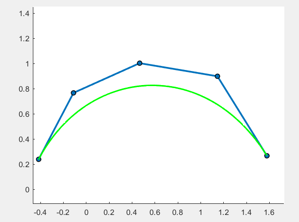

## **【报告】Bézier**

### **1.【概括】**

Matlab 实现 De Casteljau 算法绘制二维 Bézier 曲线。

### **2.【算法介绍】**

#### **(1).【算法概述】**

根据 $n$ 个控制点 $A_i$，对 $[0,1]$ 之间的均匀参数 $u$ 分别计算点 $p(u)$ 。

令 $P^{(0)}_i=A_i(1\leqslant i\leqslant n)$

根据递推式 $P^{i}_{j}=(1-u)P^{(i-1)}_{j}+uP^{(i-1)}_{j+1}(1\leqslant j\leqslant n-i)$ 进行 $n-1$ 轮迭代得到 $p(u)=P^{n-1}_1$

#### **(2).【计算坐标】**

$P$ 数组的第一维可以省略，$j$ 从左到右枚举依次刷表覆盖。

```python
for o=1:size(t,2)
    u=t(1,o);
    %tmp=A;
    for i=1:n-1
        for j=1:n-i
            P(j,:)=(1-u)*P(j,:)+u*P(j+1,:);
        end
        %tmp=P;
    end
    p(o,:)=P(1,:);%取出u处点
end
```

### **3.【结果展示】**


